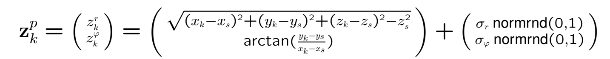

# Sensor Data Fusion

## Setup

This project has been developed using python version 3.6, also in order to 
execute the program it is necessary to install `numpy` and `matplotlib` which 
versions used for this project are in the `requirements.txt` file. They can be installed
executing from a terminal:

```bash
pip install -r requirements.txt
```

Then you can change the target and radars' parameters in the `parameters.py` file (it is possible to 
add as many sensors as you like in the `radars` list).

Then you can execute the program by simply executing the `main.py` script:

```bash
python main.py
```

### Parameters

The `Car` and `Radar` class need some parameters to create their respective instances:

* Car:
  - `v`: initial velocity of the car through the x-axes in m/s. Also used to calculate
  the position of the target in the other axes.
  - `a_x`, `a_y` and `a_y`: parameters in meters used as factors to calculate the target's position. 
  (See formula)
  
  Formula: 
  
  
 
   
* Radar:
  - `x`, `y` and `z`: positions on the respective axes of the target in meters.
  - `sigma_range` and `sigma_azimuth`: standar deviations of the radar's range and
  azimuth. Used to add some noise on the measurements (see formula).
  
  Formula:
  
  
  
### Notes

- Note 1: Some figures of the output using the default paramenters can be found in the 
`example_plots` folder.

- Note 2: Adding more increasing the default parameters of range and azimuth 
standard deviations increase the appreciation of the improvement 
after filtering and retrodiction.

- Note 3: at the end of the execution of the `exercise_4` function in `main.py`
the errors of the tracks (with and without retrodiction) are printed, the error
is calculated using the sum of distances between the track and the simulated
real trajectory for each time-step, showing the improvement on the error
reduction when applying retrodiction.
   